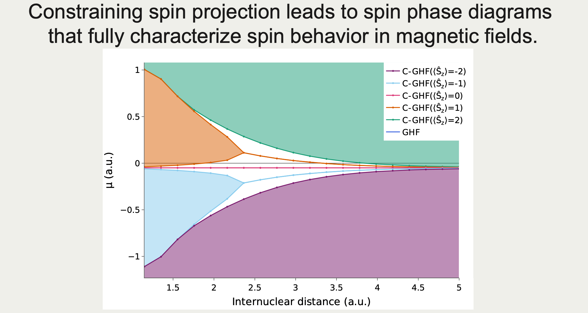

# Abstract

During molecular dissociation in the presence of an external uniform magnetic field, electrons flip their spin anti-parallel to the magnetic field due to the stabilizing influence of the spin Zeeman operator. Although generalized Hartree-Fock descriptions furnish the optimal mean-field energetic description of such bond breaking processes, they are allowed to break $\hat{S}_z$-symmetry leading to intricate and unexpected spin phases and phase transitions.
In this work, we show that the behavior of these molecular spin phases can be interpreted in terms of spin phase diagrams constructed by constraining states to target expectation values of projected spin. The underlying constrained states offer a complete electronic characterization of spin phases and spin phase transitions as they can be analyzed using standard quantum chemical tools. As the constrained states effectively span the entire phase space, they could provide an excellent starting point for post-Hartree Fock methods aimed at gaining more electron correlation or regaining spin symmetry.
